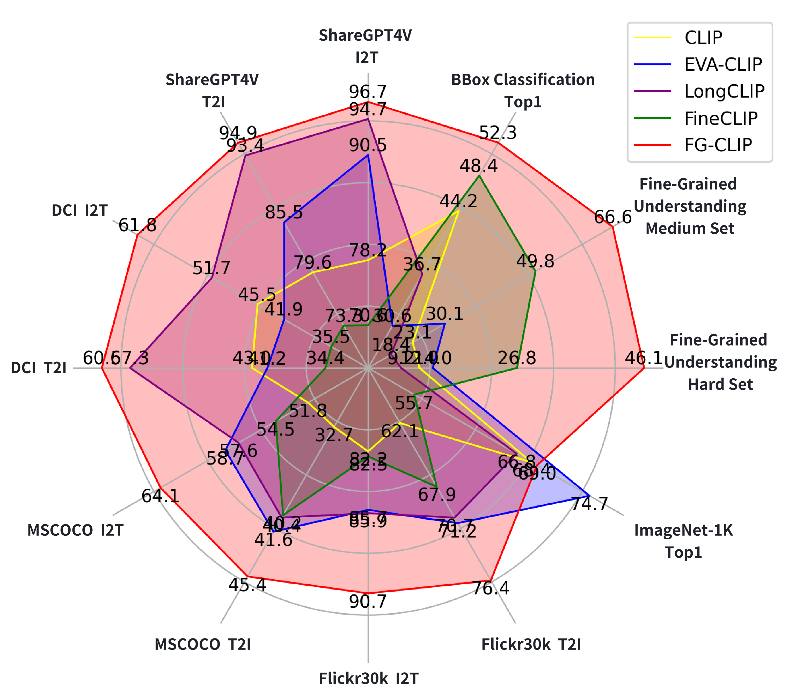
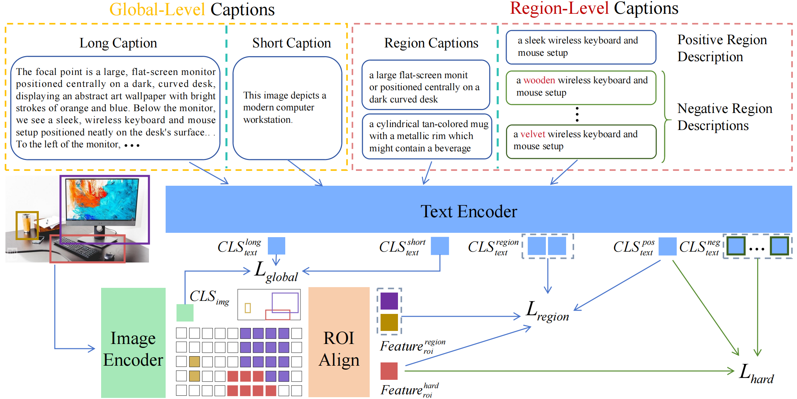
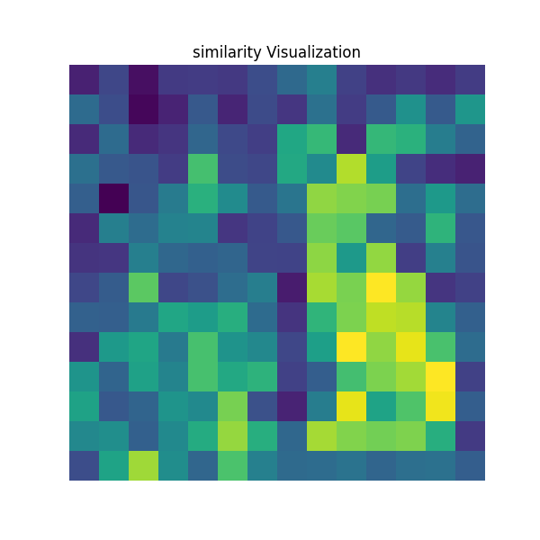

# FG-CLIP: Fine-Grained Visual and Textual Alignment

This repository is the official implementation of **FG-CLIP**, a new generation of text-image cross-modal model **excels in fine-grained discrimination and embedding.**

**[FG-CLIP: Fine-Grained Visual and Textual Alignment](https://arxiv.org/abs/2505.05071)** 
</br>
Chunyu Xie*, Bin Wang*, Fanjing Kong, Jincheng Li, Dawei Liang, Gengshen Zhang, Dawei Leng†, Yuhui Yin(*Equal Contribution, ✝Corresponding Author)
</br>
[](https://arxiv.org/abs/2505.05071)
[](https://icml.cc/Conferences/2025)
[](https://huggingface.co/collections/qihoo360/fg-clip-681da45d4acfb65c240a6d08)
[](https://huggingface.co/datasets/qihoo360/FineHARD)
[![DeepWiki](https://img.shields.io/badge/DeepWiki-FG--CLIP-blue.svg?logo=data:image/png;base64,iVBORw0KGgoAAAANSUhEUgAAACwAAAAyCAYAAAAnWDnqAAAAAXNSR0IArs4c6QAAA05JREFUaEPtmUtyEzEQhtWTQyQLHNak2AB7ZnyXZMEjXMGeK/AIi+QuHrMnbChYY7MIh8g01fJoopFb0uhhEqqcbWTp06/uv1saEDv4O3n3dV60RfP947Mm9/SQc0ICFQgzfc4CYZoTPAswgSJCCUJUnAAoRHOAUOcATwbmVLWdGoH//PB8mnKqScAhsD0kYP3j/Yt5LPQe2KvcXmGvRHcDnpxfL2zOYJ1mFwrryWTz0advv1Ut4CJgf5uhDuDj5eUcAUoahrdY/56ebRWeraTjMt/00Sh3UDtjgHtQNHwcRGOC98BJEAEymycmYcWwOprTgcB6VZ5JK5TAJ+fXGLBm3FDAmn6oPPjR4rKCAoJCal2eAiQp2x0vxTPB3ALO2CRkwmDy5WohzBDwSEFKRwPbknEggCPB/imwrycgxX2NzoMCHhPkDwqYMr9tRcP5qNrMZHkVnOjRMWwLCcr8ohBVb1OMjxLwGCvjTikrsBOiA6fNyCrm8V1rP93iVPpwaE+gO0SsWmPiXB+jikdf6SizrT5qKasx5j8ABbHpFTx+vFXp9EnYQmLx02h1QTTrl6eDqxLnGjporxl3NL3agEvXdT0WmEost648sQOYAeJS9Q7bfUVoMGnjo4AZdUMQku50McDcMWcBPvr0SzbTAFDfvJqwLzgxwATnCgnp4wDl6Aa+Ax283gghmj+vj7feE2KBBRMW3FzOpLOADl0Isb5587h/U4gGvkt5v60Z1VLG8BhYjbzRwyQZemwAd6cCR5/XFWLYZRIMpX39AR0tjaGGiGzLVyhse5C9RKC6ai42ppWPKiBagOvaYk8lO7DajerabOZP46Lby5wKjw1HCRx7p9sVMOWGzb/vA1hwiWc6jm3MvQDTogQkiqIhJV0nBQBTU+3okKCFDy9WwferkHjtxib7t3xIUQtHxnIwtx4mpg26/HfwVNVDb4oI9RHmx5WGelRVlrtiw43zboCLaxv46AZeB3IlTkwouebTr1y2NjSpHz68WNFjHvupy3q8TFn3Hos2IAk4Ju5dCo8B3wP7VPr/FGaKiG+T+v+TQqIrOqMTL1VdWV1DdmcbO8KXBz6esmYWYKPwDL5b5FA1a0hwapHiom0r/cKaoqr+27/XcrS5UwSMbQAAAABJRU5ErkJggg==)](https://deepwiki.com/360CVGroup/FG-CLIP)
[](https://research.360.cn/sass/index)

<!-- Contrastive Language-Image Pre-training (CLIP) excels in multimodal tasks such as image-text retrieval and zero-shot classification but struggles with fine-grained understanding due to its focus on coarse-grained short captions. To address this, we propose Fine-Grained CLIP (FG-CLIP), which enhances fine-grained understanding through three key innovations. First, we leverage large multimodal models to generate 1.6 billion long caption-image pairs for capturing global-level semantic details. Second, a high-quality dataset is constructed with 12 million images and 40 million region-specific bounding boxes aligned with detailed captions to ensure precise, context-rich representations. Third, 10 million hard fine-grained negative samples are incorporated to improve the model's ability to distinguish subtle semantic differences. Corresponding training methods are meticulously designed for these data. Extensive experiments demonstrate that FG-CLIP outperforms the original CLIP and other state-of-the-art methods across various downstream tasks, including fine-grained understanding, open-vocabulary object detection, image-text retrieval, and general multimodal benchmarks. These results highlight FG-CLIP's effectiveness in capturing fine-grained image details and improving overall model performance. -->


<!-- ## Model Performance -->
<!-- ### Long/short caption image-text retrieval, and zero-shot image classification..  -->

 <p align="center">
  
</p>


## 🔥 News
- 🚀 **[2025/07/29]** We provide API access of FG-CLIP v2 base model, which out-performs FG-CLIP v1 by significant margin, check [research.360.cn](https://research.360.cn/sass/index) for details.
- 🚀 **[2025/07/09]** We created two new demos for easy testing, for [fine-grained retrieval](https://huggingface.co/spaces/qihoo360/FG-CLIP-Retrieval-demo) and [dense feature display](https://huggingface.co/spaces/qihoo360/FG-CLIP-Densefeature-demo)
- 🚀 **[2025/05/09]** We have uploaded the model to 🤗(https://huggingface.co/qihoo360/fg-clip-large), which supports quick and easy usage!
- 🚀 **[2025/05/09]** We have updated the FG-CLIP github repository, and now you can test our models!
- 🚀 **[2025/05/09]** We released the paper of [FG-CLIP: Fine-Grained Visual and Textual Alignment](https://arxiv.org/abs/2505.05071).
- 🚀 **[2025/05/02]** FG-CLIP has been accepted by ICML'25.

## Contents
- [Model Framework](#ModelFramework)
- [Install](#install)
- [Model Zoo](#modelzoo)
- [Quick Start](#quickstart)
- [Train](#train)
- [Evaluation](#evaluation)


## Model Framework
FG-CLIP’s training proceeds in two stages: the first stage leverages
global-level caption-image pairs to achieve initial fine-grained alignment, while the second stage supplements these with additional
region-level captions, including detailed region captions and positive/negative region descriptions to further refine the alignment.
<p align="center">
  

## Install

```Shell
conda create -n FGCLIP python=3.10 -y
conda activate FGCLIP
cd FG-CLIP && pip install -e .
```
## Model Zoo: 
[🤗Vit-B@224px](https://huggingface.co/qihoo360/fg-clip-base)
</br>
[🤗Vit-L@336px](https://huggingface.co/qihoo360/fg-clip-large)

<!-- <p align="center">
  
</p> -->

## Quick Start 🤗

### Load Model
```Shell
import torch
from PIL import Image
from transformers import (
    AutoImageProcessor,
    AutoTokenizer,
    AutoModelForCausalLM,
)


model_root = "qihoo360/fg-clip-base"
image_size=224
model = AutoModelForCausalLM.from_pretrained(model_root,trust_remote_code=True).cuda()

device = model.device

tokenizer = AutoTokenizer.from_pretrained(model_root)
image_processor = AutoImageProcessor.from_pretrained(model_root)
```


### Retrieval

```Shell

img_root = "FG-CLIP/use_imgs/cat_dfclor.jpg"
image = Image.open(img_root).convert("RGB")
image = image.resize((image_size,image_size))

image_input = image_processor.preprocess(image, return_tensors='pt')['pixel_values'].to(device)

# NOTE Short captions: max_length=77 && walk_short_pos=True
walk_short_pos = True
captions=["a photo of a cat", "a photo of a dog"]
caption_input = torch.tensor(tokenizer(captions, max_length=77, padding="max_length", truncation=True).input_ids, dtype=torch.long, device=device)

# NOTE Long captions: max_length=248 && walk_short_pos=False
# ......

with torch.no_grad():
  image_feature = model.get_image_features(image_input)
  text_feature = model.get_text_features(caption_input,walk_short_pos=walk_short_pos)
  image_feature = image_feature / image_feature.norm(p=2, dim=-1, keepdim=True)
  text_feature = text_feature / text_feature.norm(p=2, dim=-1, keepdim=True)

logits_per_image = image_feature @ text_feature.T 
logits_per_image = model.logit_scale.exp() * logits_per_image
probs = logits_per_image.softmax(dim=1) 
print(probs)
# [[9.9997e-01, 3.3485e-05]]
```

### Dense feature effect display

```Shell

import math
import matplotlib
matplotlib.use('Agg') 
import matplotlib.pyplot as plt


img_root = "FG-CLIP/use_imgs/cat_dfclor.jpg"
image = Image.open(img_root).convert("RGB")
image = image.resize((image_size,image_size))

image_input = image_processor.preprocess(image, return_tensors='pt')['pixel_values'].to(device)

with torch.no_grad():
    dense_image_feature = model.get_image_dense_features(image_input)
    captions = ["white cat"]
    caption_input = torch.tensor(tokenizer(captions, max_length=77, padding="max_length", truncation=True).input_ids, dtype=torch.long, device=device)
    text_feature = model.get_text_features(caption_input,walk_short_pos=True)
    text_feature = text_feature / text_feature.norm(p=2, dim=-1, keepdim=True)
    dense_image_feature = dense_image_feature / dense_image_feature.norm(p=2, dim=-1, keepdim=True)

similarity = dense_image_feature.squeeze() @ text_feature.squeeze().T
similarity = similarity.cpu().numpy()
patch_size = int(math.sqrt(similarity.shape[0]))


original_shape = (patch_size, patch_size)
show_image = similarity.reshape(original_shape) 


plt.figure(figsize=(6, 6))
plt.imshow(show_image)
plt.title('similarity Visualization')
plt.axis('off')  
plt.savefig("FG-CLIP/use_imgs/FGCLIP_dfcolor_cat.png")

```
<!-- /home/jovyan/wangbin-home-shcdt/image_text_match/FG-CLIP/use_imgs/FGCLIP_dfcolor_cat.png -->
 <p align="left">
  
</p>


## Train

### Data Preparation

We develop a high-quality visual grounding dataset named [FineHARD](https://huggingface.co/datasets/qihoo360/FineHARD), featuring precise region-specific captions and challenging negative samples. We curate the overall dataset based on GRIT images. The process begins with generating detailed image captions using [CogVLM2-19B](https://huggingface.co/THUDM/cogvlm2-llama3-chat-19B), ensuring comprehensive and nuanced descriptions that capture the full context of each image. We then use [SpaCy](https://github.com/explosion/spaCy) to parse the captions and extract the referring expressions. Subsequently, the images and referring expressions are fed into the pretrained object detection model, i.e., [Yolo-World](https://github.com/AILab-CVC/YOLO-World) to obtain the associated bounding boxes. Non-maximum suppression is applied to eliminate overlapping bounding boxes, retaining only those with predicted confidence scores higher than 0.4. This process results in 12 million images and 40 million bounding boxes with fine-grained region captions.
</br>
For data preparation, please refer to: [[Data: FineHARD](data/data.md)]


### Ready for Training
Our training and inference code is completely based on the transformers repository provided by huggingface, which is a very easy to use and easy to reproduce. We have provided the training script in the scripts directory.
</br>
[🤗 Transformers: State-of-the-art Machine Learning for Pytorch, TensorFlow, and JAX.](https://github.com/huggingface/transformers)
</br>
Our training script supports the use of zero2, tf32 acceleration, and bf16 precision (note that fp16 precision may cause gradient NAN). If you do not meet the above conditions, please turn off tf32 and replace deepspeed startup with torchrun.
</br>
```Shell
bash scripts/train.sh
```


## Evaluation
### Data Preparation
Download the share-captioner_coco_lcs_sam_1246k_1107.json from the following link 
https://huggingface.co/datasets/Lin-Chen/ShareGPT4V/blob/main/share-captioner_coco_lcs_sam_1246k_1107.json

Download the CocoCaptions from the following link nd put them into data/coco/annotations/
https://github.com/tylin/coco-caption

Download the COCO from the following link and put them into data/coco
https://cocodataset.org/dataset

Captions of DCI are from the following links and put them into data/densely_captioned_images
https://github.com/facebookresearch/DCI

ImageNet-1K from from the following links and put them into data/IN1K_val
https://image-net.org/

ImageNet-v2 from the following links and put them into data/imagenetv2-matched-frequency-format-val
https://opendatalab.com/OpenDataLab/ImageNetV2/tree/main

```none
FG-CLIP
├── ...
├── data
|   ├── share-captioner_coco_lcs_sam_1246k_1107.json
│   ├── coco
│   │   ├── train2017
│   │   ├── val2017
│   │   ├── annotations
│   │   |   ├── captions_val2017.json
│   ├── fgovd
│   │   ├── h_attributes_llava.jsonl
│   │   ├── m_attributes_llava.jsonl
│   │   ├── e_attributes_llava.jsonl
│   │   ├── shuffle_negatives_llava.jsonl
│   ├── sam
│   │   ├── images
│   │   |   ├──138
│   ├── densely_captioned_images
│   │   ├── annotations
│   │   |   ├── ...
│   ├── IN1K_val
│   │   ├── val
│   │   ├── imagenet2012_mapclsloc.txt
│   ├── imagenetv2-matched-frequency-format-val
├── ...
```


### Long/Short caption image-text retrieval

```Shell
bash scripts/eval/eval_long.sh
bash scripts/eval/eval_coco_retrieval.sh
```
### Bounding box classification of COCO

```Shell
bash scripts/eval/eval_coco_boxcls.sh
```

### FG-OVD benchmark
```Shell
bash scripts/eval/eval_fgovd.sh
```

### Zero-Shot classification
```Shell
bash scripts/eval/eval_in1k.sh
bash scripts/eval/eval_v2.sh
```


<!-- ## Acknowledgement -->
## We Are Hiring
We are seeking academic interns in the Multimodal field. If interested, please send your resume to xiechunyu@360.cn.
## Citation
If you find FG-CLIP useful for your research and applications, please cite using this BibTeX:

```
@article{xie2025fgclip,
      title={FG-CLIP: Fine-Grained Visual and Textual Alignment}, 
      author={Chunyu Xie and Bin Wang and Fanjing Kong and Jincheng Li and Dawei Liang and Gengshen Zhang and Dawei Leng and Yuhui Yin},
      year={2025},
      eprint={2505.05071},
      archivePrefix={arXiv},
      primaryClass={cs.CV},
      url={https://arxiv.org/abs/2505.05071}, 
}
```


## License

This project utilizes certain datasets and checkpoints that are subject to their respective original licenses. Users must comply with all terms and conditions of these original licenses.
The content of this project itself is licensed under the [Apache license 2.0](./LICENSE).

## Related Projects
This work wouldn't be possible without the incredible open-source code of these projects. Huge thanks!
- [CLIPSelf](https://github.com/wusize/CLIPSelf.git)
- [FineCLIP](https://github.com/Timsty1/FineCLIP)
- [LLava](https://github.com/haotian-liu/LLaVA)
- [LongCLIP](https://github.com/beichenzbc/Long-CLIP.git)
